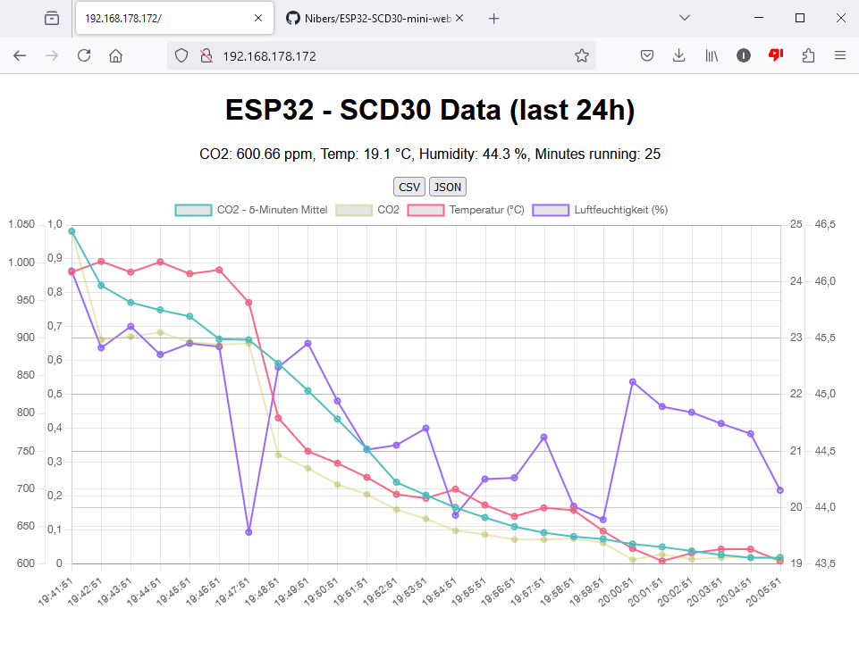
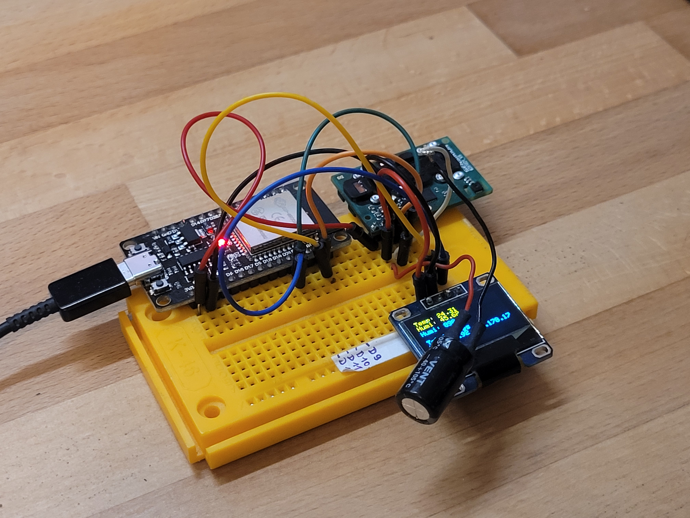

# ESP32 CO₂, Temperature, and Humidity Web Server

This project is an ESP32-based web server that reads CO₂, temperature, and humidity data from an SCD30 sensor. The data is stored and visualized using **Chart.js** in a web interface. The server provides current data with plots for the last 24 hours.

All of required code is in one file `ESP32-SCD30-mini-webserver.ino` , making the project very easy to set up.

<p float="left">
  
  
</p>

## Features

- **Real-time Monitoring**: CO₂ concentration, temperature, and humidity displayed live.
- **24-Hour Data Logging**: Records and displays data for the last 24 hours at 1-minute intervals.
- **Web Visualization**: Access the data via a web browser with charts powered by **Chart.js**.

## Hardware Requirements

- **ESP32** microcontroller
- **SCD30** CO₂ sensor (supports temperature and humidity measurements)
- **ssd1306** OLED Display (optional) - you need to comment the corresponding lines out if you dont connect a display.

## Software Requirements

- **Arduino IDE**
- **Adafruit SCD30 Library**: Install via the Arduino Library Manager (`Sketch > Include Library > Manage Libraries...`).

## Installation

1. Clone this repository:
   ```bash
   git clone https://github.com/yourusername/esp32-scd30-webserver.git
   ```
2. Open the project in the **Arduino IDE**.

3. Install the necessary libraries:
   - `Adafruit SCD30 Library`
   - `WiFi` (comes pre-installed for ESP32)

4. Update the Wi-Fi credentials in the `config.h` code:
   ```cpp
   const char* ssid = "YOUR_WIFI_SSID";
   const char* password = "YOUR_WIFI_PASSWORD";
   ```

5. Upload the code to your ESP32 board.

6. (Optional) If you get an error because the file `config.h`could not be found:
    - Go to `Sketch > Add File....`
    - Add the file `config.h`

## How It Works

- The ESP32 connects to the specified Wi-Fi network and starts a web server on port `80`.
- Sensor readings are taken every 2 seconds.
- Data samples are recorded every minute, up to a 24-hour limit (1440 samples).
- Visit the ESP32's IP address in a web browser to view real-time data and plots.

## Accessing the Web Server

1. Find the ESP32's IP address in the serial monitor.
2. Enter the IP address in a web browser:
   ```
   http://<ESP32_IP_ADDRESS>
   ```

   The local address that the ESP32 uses it beeing logged in the serial monitor

## Example Output

In the web interface, you'll see:

- **Current Measurements**:  
  - CO₂ (ppm)  
  - Temperature (°C)  
  - Humidity (%)  

- **Charts**:  
  - CO₂ concentration over time (with a 5-minute moving average)  
  - Temperature trend  
  - Humidity trend  

## License

This project is licensed under the [MIT License](LICENSE).